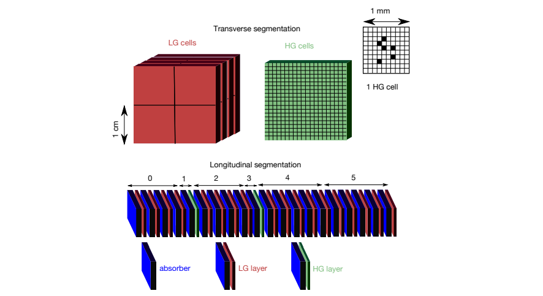
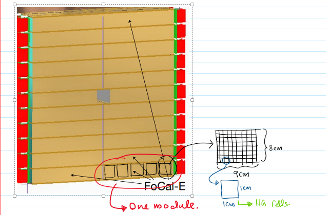
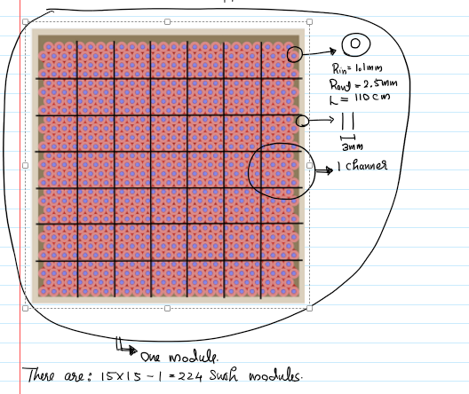
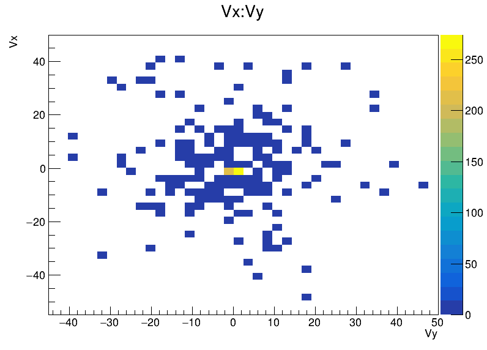
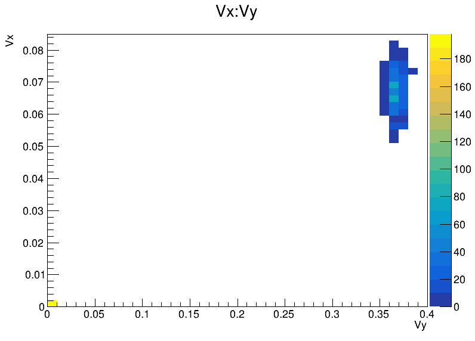
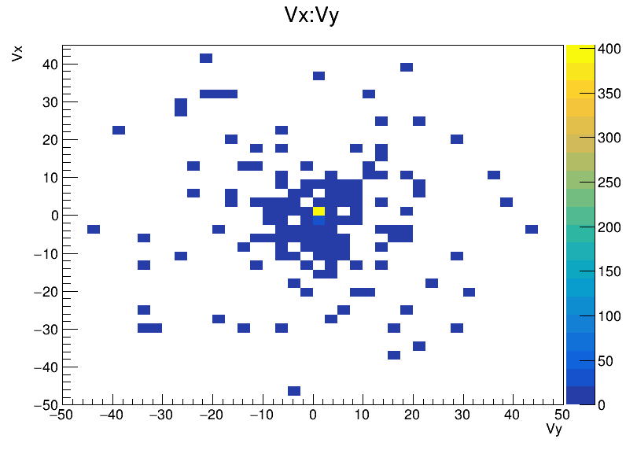
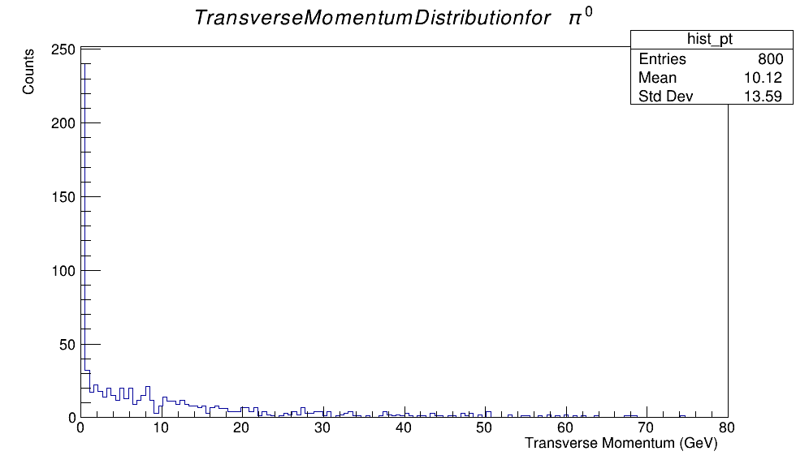
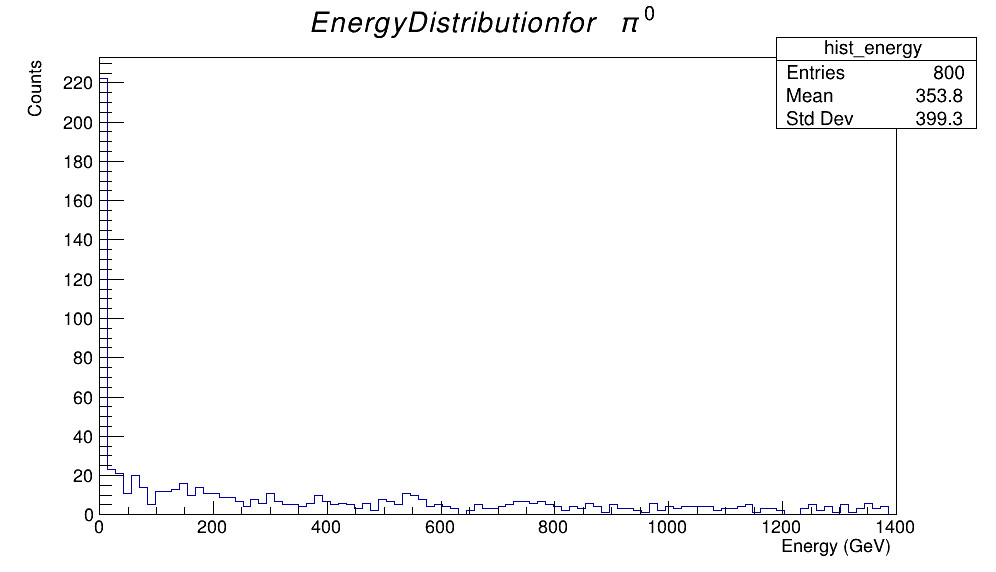
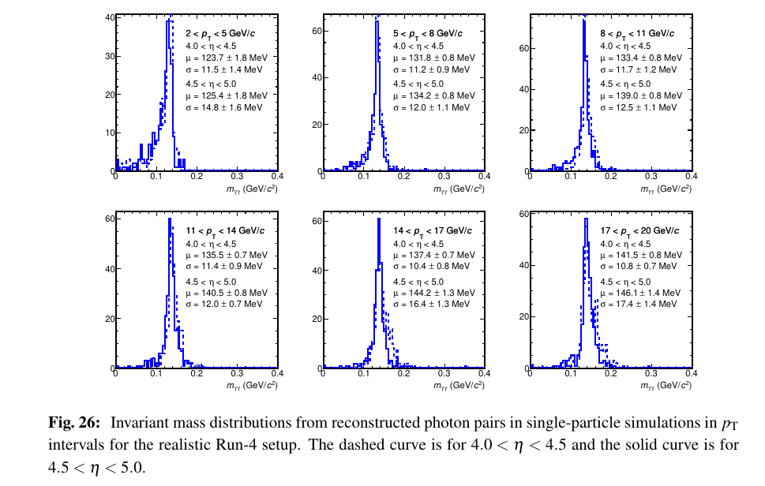

# Project Progress
```LaTeX
Anantha Padmanabhan M Nair
National Institute of Science Eduvation and Research, Bhubaneswar  
Int MSc in Physics
MSc Project in ALICE Collaboration  
Email: apm.nair@niser.ac.in
```


## Week-1 (26/5/24 - 1/6/24)

### Stuffs Done

- 27th-Installing aliBuild (error- repo access issue)
- 28th-Installing aliBuild (error-Memory issue)
- 29th-Installing aliBuild (after installing Ubuntu in HDD with more space)
- 30th-Started Readig the pdf for ALICE Proposal
- 31th-Had a Meeting and was assigned works

### To Do for Next Week

- Complete the ALICE pdf
- Figure out how to run the DPG simulation with box parameter and different Particles
- figure out whats happeining in the clusetering codes in ALIsimV2.CXX
- Learn the UNIX terminal commands
- Attend the meeting at 5pm on 5 june Wednesday


## Week-2 (2/6/24 - 8/6/24)

### Stuffs Done

#### 2<sup>nd</sup> June Reading the ALICE Proposal pdf

#### Why Focal?

- To measure the direct photon in p-Pb and pp collisions at forward rapidity to explore the small-x structure of the photons and nuclei at high energy.
- The measurement of high transverse momentum neutral pions in Pb-Pb collisions, and their modification relative to pp collisions.

"Large rapidity measurements require a placement of the detector close to the beam pipe. As the particle density in these regions is very high due to the kinematic boost of produced particles a large distance from the primary interaction vertex is advantageous"-from pdf

"The FoCal acceptance is $3.4 \le \eta \le 5.8$. This corresponds to an outer radius of $r \approx 5$ cm and an inner radius of $r \approx 4$ cm. The lower limit on $p^T$ is not well defined as it depends on the actual signal-to-background ratio of the measurement" - from pdf

"The main limitation arises from the necessity of discriminating between direct photons and decay photons from neutral pions. This can be estimated by assuming that a detector is capable of resolving the two decay photons from a neutral pion, when they have a certain minimum lateral separation d at the detector, located at a distance $z_{det}$" - from pdf.

The maximum transverse momentum is approximated by:

$$ p_{T}^{max} \approx 2\pi m_{\pi} e^{-\eta} \sqrt{\frac{2}{(1-\alpha^2)(1-\cos{(d/z_{det})})}}  $$


where $\alpha$ denotes the decay photon energy asymmetry $\alpha = |E_1 - E_2|/(E_1 + E_2)$.

#### What is rapidity and pseudorapidity?

**Rapidity** $\eta$ is defined in terms of a particle's energy $E$ and its longitudinal momentum $p_z$ ($p_z$ is the component of momentum along the direction of the particle beam) as:

$$\eta = \frac{1}{2} \ln \left( \frac{E+p_z}{E-p_z} \right) $$

**Pseudorapidity**: Pseudorapidity is defined in terms of the polar angle ($\theta$) of the particle with respect to the beam axis:

$$ \eta = -\ln \left( \tan \left( \frac{\theta}{2} \right) \right) $$

where $\theta$ is the angle between the particle and the beam axis.

#### The FoCal-E Detector Design

FoCal-E is an electromagnetic calorimeter. For this a small shower size is necessary to minimize occupancy effects and to optimize the photon shower separation. Tungsten is chosen because it has a low Molière Radius with values of $R_M = 9$ mm and $X_0 = 3.5$ mm (The Molière radius, typically denoted as $R_M$, is defined as the radius within which approximately 90% of the energy of an electromagnetic shower is contained. It provides a measure of how the shower particles spread out laterally as they propagate through a material) and radiation length $X_0$ (The radiation length is the mean distance over which a high-energy electron loses all but \(\frac{1}{e}\) (about 63%) of its energy due to bremsstrahlung, which is the radiation emitted when a charged particle, like an electron, is decelerated by another charged particle, typically a nucleus).

The detector consists of a Si+W sampling calorimeter hybrid design using two different Si readout technologies:

1. Pad Layers with effective cell size of $1cm^2 \approx R_M^2$
2. Pixel layers, with digital readout and a cell size of $\approx 30 \times 30 \mu m^2$, i.e., much smaller than the Molière radius, read out independently.

The schematics of the FoCal-E is shown in the figure \ref{focalEpic}.


*Figure 1: Schematics of the FoCal-E*

All of the layers will have a tungsten-thickness of 1 cm which is $\approx 1X_0$ followed by silicon sensors. Figure \ref{focalEpic} schematically shows the FoCal-E structure with 18 pad layers and two pixel layers, positioned at the 5th and 10th layer. The cells in each layer will be read out individually, but for the purpose of cluster finding, the layers are grouped into 6 segments.


#### The FoCal-H Detector Design

The FoCal-H is required for the photon isolation and jet measurements. The FoCal-H has the same range of pseudorapidity as the FoCal-E. It is planned to be placed a distance of 7.5 cm from the IP, just in front of the ALICE compensator magnet.

FoCal-H can be constructed as a relatively conventional sampling hadronic calorimeter with a total thickness of approximately \(6\lambda_{\text{had}}\) and an extent of \(\Delta z \sim 1.1\) meters. In contrast to FoCal-E, the hadronic calorimeter requires only transverse segmentation and not longitudinal segmentation. The detector has a similar transverse size as FoCal-E, with an outer dimension of \(r \sim 0.45\) meters, and an estimated total weight of around 8t. Various implementations of the sampling structure of the detector are under consideration, including a sandwich-type (scintillator plates) or a spaghetti-type (scintillator fibers) detector.

#### 3<sup>rd</sup> June Running the DPG simulation with box parameter and different Particles

Tried to run the simulations with the box parameter and different particles. The codes were showing the SEGMENTATION VIOLATION error. But anyways the root files are being generated. Also started preparing the slides.

#### 4<sup>th</sup> June Had Meeting With Mriganka sir and fixed the issues running the DPG simulation

I was able to run the simulations and also the Analysis code in the DPG simulation along with the MCIinfo and Clustering codes.

Steps to run the Analysis Simulations are as follows:
1. First run the DPG simulation with the box parameter and different particles so that the root files are generated.
2. Move the generated root files to a folder named "1".
3. Change the file paths inside the code of the MCIinfo, clustering, and Analysis .C files.
4. The arguments to run the analysis (mci or clustering) is: `./runAnalysis 1 1 0 9` where the 0 is the initial event number and the 9 is the final event number. 1 is the location of the root files.
5. The order of doing it is first run the MCIinfo code, then the clustering code, and finally the Analysis code.
6. The output of the Analysis code is the root file with the histograms of Energy, $\eta$, $\phi$, etc.

To Do for the Next Meeting on 7th June:
- Run the Simulation code with the particles $\gamma$ (22), $\pi^0$ (111), $\pi^+$ (211) and the box parameter for 1000 Events.
- Run the Analysis code with the particles $\gamma$ (22), $\pi^0$ (111), $\pi^+$ (211) and the box parameter for 1000 Events, and find out what the codes are doing with the root file, then relate it with the detector geometry.
- Prepare a presentation on the above points.
- Understand how to run MCInfo and Clustering codes.


#### 5<sup>th</sup> June : Sunning the simulation for 1000 events

#### 6<sup>th</sup> June : Running the Simulations for 100 events with pions and photons, and preparing the Slides.

Ran the simulations for 100 events with pions and photons. The root files were generated. The generated root files were then analyzed using the MCInfo,Clusetring and Analysis. Also prepared the slides for the presentation.


#### 7<sup>th</sup> June : Had a meeting with Mriganka sir and discussed the results of the simulations and the analysis codes.


#### 8<sup>th</sup> June : Preparing the presentation and understanding the Analysis and plotting the histograms and also improved the understanding of the Detector Geometry.

The detector geometry for the FoCal-E and FoCal-H is as follows:

The Image of the Focal E is shown below:


*Figure 2: The FoCal-E Detector Geometry*


### To Do for Next Week

- Run the simulations for 1000 events with pions and photons.
- Complete the presentation and present it.
- Understand the Analysis and plotting the histograms and present it.
- Understand the MCInfo and Clustering codes.
- The Image of the Focal-E is shown below:
  

- The Image of the Focal-H is shown below:
  



### To Do for Next Week

- Complete the Presentation and present it.
- Understand the Analysis and plotting the histograms and present it.
- Understand the MCInfo and Clustering codes.


## Week-3 (9/6/24 - 15/6/24)

### Stuffs Done

#### 9<sup>th</sup> June : Studying the MCInfo Code.

The MCInfo is defined as:
```cpp
void MCInfo(Int_t startFolder, Int_t endFolder, Int_t startEvent, Int_t endEvent){}
```

The returns of the Function is the MCInfo.root file which contains the information of the particles generated in the simulation.


The MCInfo code is as follows:


Defining the Parameters:
```cpp
	// Parameteres for getting weighting function info
	Float_t infoParameterSigma = 1.0;
	Float_t infoParameterFitRadius = 5;
	Float_t infoParameterHistRadius = 5;

	char dataSampleTag[200] = "";
	char simFolder[200] ="/home/apmnair18/Documents/MSc_Project/Simulation_outputs/pdg211_nevents250";
	char infoOutputFileDir[200] = "/home/apmnair18/Documents/MSc_Project/Analysis_outputs/pdg211_nevents250/";

	const Float_t profileRadius = 5; // [cm] distance for collecting digits for shower profile

	Long_t totalEvents = 0;
```


The Geometry is read as:
```cpp
	// Get geometry;
	AliFOCALGeometry *geometry = new AliFOCALGeometry();
	const Char_t *detectorGeometryFile = gSystem->ExpandPathName("/home/apmnair18/Documents/MSc_Project/Simulation/GeometryFiles/geometry.txt");
	geometry->Init(detectorGeometryFile);
	Int_t nSegments = geometry->GetVirtualNSegments();//GEts the virtual Segments

	Float_t z_FOCAL_front = geometry->GetFOCALZ0() - geometry->GetFOCALSizeZ() / 2 - 0.1;
    // Calculates the position of the Front of the FOCAL Detector
	AliFOCALDigitizer *digitizer = new AliFOCALDigitizer();//Creates the Digitizer
	digitizer->SetGeometry(geometry);
	digitizer->Initialize("HS"); //HS is for Homogeneous Smearing
```


The particle Properties are defined as:
```cpp
	// Event info
	Char_t folder[200];
	Int_t event;

	// Incident particle info
	Int_t pdgCode[4];
	Float_t e[4]; //charge
	Float_t pt[4]; //transverse momentum etc
	Float_t phi[4]; 
	Float_t theta[4];
	Float_t Vx[4], Vy[4], Vz[4];
	Float_t cVx[4], cVy[4], cVz[4];
	Int_t conv_flag[4];

	// Fit info
	Float_t *totalE = new Float_t[2 * nSegments];
	Float_t *maxE = new Float_t[2 * nSegments];
	Float_t *sigma = new Float_t[2 * nSegments];
	Float_t *ampl = new Float_t[2 * nSegments];
	Float_t *chi2 = new Float_t[2 * nSegments];
	Int_t *ndef = new Int_t[2 * nSegments];
```

Creating the histograms:
```cpp
	// profile histos
	TH2F **showProf2DEvent = new TH2F *[nSegments];
    //  showProf2DEvent is the dynamically allocated array of pointers to TH2F objects
    //  with one pointer for each segment 
	TH1F **showProf1DEvent = new TH1F *[nSegments];
    //  showProf1DEvent is the dynamically allocated array of pointers to TH1F objects
    //  with one pointer for each segment
	for (Int_t i = 0; i < nSegments; i++)
	{
		Int_t nBins = 5;
		Float_t cellSize = 1;
		if (i == 1 || i == 3) // different bins and cell size for segments 1 and 3
		{
			nBins = 50;
			cellSize = 0.1;
		}
		Float_t lim = 5 + 0.5 * cellSize; // Limit for the x and y axis
		showProf2DEvent[i] = new TH2F(Form("prof2DEvent_%d", i), Form("Shower profile seg %d;x (cm);y (cm)", i), 2 * nBins + 1, -lim, lim, 2 * nBins + 1, -lim, lim);
		showProf1DEvent[i] = new TH1F(Form("profEvent_%d", i), Form("Shower profile seg %d;r (cm);dN/rdr", i), nBins + 1, -0.5 * cellSize, lim);
	}

    // The above code creates the histograms for the shower profile for each segment

```


Then we loop through the folders to get the info from the galice,FITS.HITS.root and Kinematics.root.

The loop is done based on the assumption that the simFolder contains these files in the folder named 1,2,3,...n.

The loop is as follows:

```cpp
	for (Int_t nfolder = startFolder; nfolder <= endFolder; nfolder++){
    // Get info code
    }
```

The above mentioned files are read by the code:
```cpp
		char filename[200];
		sprintf(filename, "%s/%i/%s", simFolder, nfolder, "galice.root");

		Long_t id, size, flags, mt;
		if (gSystem->GetPathInfo(filename, &id, &size, &flags, &mt) == 1)
		{
			cout << "ERROR: FOLDER: " << nfolder << endl;
			continue;
		}

		char filenameHits[200];
		sprintf(filenameHits, "%s/%i/%s", simFolder, nfolder, "FOCAL.Hits.root");

		if (gSystem->GetPathInfo(filenameHits, &id, &size, &flags, &mt) == 1)
		{
			cout << "ERROR: FOLDER: " << nfolder << endl;
			continue;
		}

		char filenameKin[200];
		sprintf(filenameKin, "%s/%i/%s", simFolder, nfolder, "Kinematics.root");

		if (gSystem->GetPathInfo(filenameKin, &id, &size, &flags, &mt) == 1)
		{
			cout << "ERROR: FOLDER: " << nfolder << endl;
			continue;
		}
```
Loading the AliRunLoader:
```cpp
		// Alice run loader
		AliRunLoader *fRunLoader = AliRunLoader::Open(filename);

		if (!fRunLoader)
		{
			cout << "ERROR: FOLDER: " << nfolder << endl;
			continue;
		}
		cout << "Got runloader" << endl;

		if (!fRunLoader->GetAliRun())
			fRunLoader->LoadgAlice();
		if (!fRunLoader->TreeE())
			fRunLoader->LoadHeader();
		if (!fRunLoader->TreeK())
			fRunLoader->LoadKinematics();

		gAlice = fRunLoader->GetAliRun();
```

Initialising the detector:

```cpp
		// Focal init
		AliFOCAL *fFOCAL = (AliFOCAL *)gAlice->GetDetector("FOCAL");
		AliFOCALLoader *fFOCALLoader = dynamic_cast<AliFOCALLoader *>(fRunLoader->GetLoader("FOCALLoader"));
		fFOCALLoader->LoadHits("READ");
```


Next is the creation of the Output root file MCInfo__1.root. The file is opened in "RECREATE" mode, meaning if a file with the same name already exists, it will be overwritten.

- The ```f->cd()``` call changes the current directory to the one represented by the ```TFile``` object ```f```. In the context of ROOT, this means that any new objects (like histograms, trees, etc.) created after this call will be stored in this file unless another directory is specified or changed to.
- A ```TTree``` named ```tInfo``` is created with a title ```"MonteCarlo and other information"```.
- The Branch method is used to add branches to the tInfo tree. Each branch represents a different piece of data to be stored. For example, the branch "Folder" stores a character array representing a folder name, "Event" stores an integer representing an event number, and other branches store arrays of integers or floats representing various properties of particles (like their energy, momentum, position, etc.). The notation like "Folder[200]/C" specifies the data type and size of the array for each branch (in this case, a character array of size 200)
-  This tree is meant to store detailed information about particles detected after runing the Simulation. This includes basic properties like energy (```Energy```), transverse momentum (```Pt```), azimuthal angle (```Phi```), polar angle (```Theta```), and vertex positions (```Vx, Vy, Vz```). It also stores more specific information like particle identification codes ```(PdgCode)```, conversion flags (```conv_flag```), corrected vertex positions (```cVx, cVy, cVz```), and various statistical measures (```TotalEnergy, MaxEnergy, Sigma, Amplitude, Chi2, NDEF```)


Creating the output ROOT files defining the trees and branches:
```cpp
		gSystem->mkdir(infoOutputFileDir, true);

		TFile *f = new TFile(Form("%s/MCInfo_%s_%i.root", infoOutputFileDir, dataSampleTag, nfolder), "RECREATE");
		f->cd();
		TTree *tInfo = new TTree("MCInfo", "MonteCarlo and other information");

		tInfo->Branch("Folder", &folder, "Folder[200]/C");
		tInfo->Branch("Event", &event, "Event/I");

		// Particles, mother + daughters
		tInfo->Branch("PdgCode", pdgCode, "PdgCode[4]/I");
		tInfo->Branch("Energy", e, "Energy[4]/F");
		tInfo->Branch("Pt", pt, "Pt[4]/F");
		tInfo->Branch("Phi", phi, "Phi[4]/F");
		tInfo->Branch("Theta", theta, "Theta[4]/F");

        // Vertex info
		tInfo->Branch("Vx", Vx, "Vx[4]/F");
		tInfo->Branch("Vy", Vy, "Vy[4]/F");
		tInfo->Branch("Vz", Vz, "Vz[4]/F");
		tInfo->Branch("conv_flag", conv_flag, "conv_flag[4]/I");
		tInfo->Branch("cVx", cVx, "cVx[4]/F");
		tInfo->Branch("cVy", cVy, "cVy[4]/F");
		tInfo->Branch("cVz", cVz, "cVz[4]/F");


        // Fit info
		tInfo->Branch("TotalEnergy", totalE, "TotalEnergy[40]/F");
		tInfo->Branch("MaxEnergy", maxE, "MaxEnergy[40]/F");
		tInfo->Branch("Sigma", sigma, "Sigma[40]/F");
		tInfo->Branch("Amplitude", ampl, "Amplitude[40]/F");
		tInfo->Branch("Chi2", chi2, "Chi2[40]/F");
		tInfo->Branch("NDEF", ndef, "NDEF[40]/I");
```

Now we will create the profile histograms for the shower profile.
- The code dynamically allocates arrays of pointers to TProfile2D and TProfile objects, which are specialized histogram classes in ROOT for storing 2D and 1D profile histograms, respectively.

-  The ```for``` loop iterates over each segment of the detector. For each segment, it initializes variables ```nBins``` and ```cellSize``` which is the size of each bin with default values. However, for segments 1 and 3, it assigns different values to ```nBins``` and ```cellSize```, indicating that these segments might have a finer granularity. in terms of the FOCAL detector, these must be the pixel layers


for the code:
- ```Form("prof2DEvent_%d", i)```: Generates a unique name for each histogram based on the segment index.
- ```Form("Shower profile seg %d;x (cm);y (cm)", i)```: Generates a title for each histogram.
- ```2 * nBins + 1```: Number of bins for the x and y axes.
- ```-lim, lim```: The range for the x and y axes.

So there are 3 profiles for each segment: One 2D, and other two 1D.
- The 2D profile is for the variation of $\frac{dN}{dr}$ with respect to the position in the x-y plane.
- One of the 1D profile is for the variation of $\frac{dN}{dr}$ with respect to the distance from the center of the shower.
- The other 1D profile is for the variation of $\frac{dN}{dr}$ with respect to the distance from the center of the shower, but normalized by the maximum energy in the shower.

The code for the same is given below:


```cpp
		// profile histos
		TProfile2D **showProf2D = new TProfile2D *[nSegments];
		TProfile **showProf1D = new TProfile *[nSegments];
		TProfile **showProf1D_dEdr = new TProfile *[nSegments];
		for (Int_t i = 0; i < nSegments; i++)
		{
			Int_t nBins = 5;
			Float_t cellSize = 1;
			if (i == 1 || i == 3)
			{
				nBins = 50;
				cellSize = 0.1;
			}
			Float_t lim = 5 + 0.5 * cellSize;
			showProf2D[i] = new TProfile2D(Form("prof2D_%d", i), Form("Shower profile seg %d;x (cm);y (cm)", i), 2 * nBins + 1, -lim, lim, 2 * nBins + 1, -lim, lim);
			showProf1D[i] = new TProfile(Form("prof_%d", i), Form("Shower profile seg %d;r (cm);dN/rdr", i), nBins + 1, -0.5 * cellSize, lim);
			showProf1D_dEdr[i] = new TProfile(Form("prof_dEdr_%d", i), Form("Shower profile seg %d;r (cm);dN/dr", i), nBins + 1, -0.5 * cellSize, lim);
		}
```


Now we have to loop over all the events in the current Folder/File like:
```cpp
for (Int_t ievt = startEvent; ievt <= endEvent; ievt++){
    // Code to get the info of the particles
    }
```


Within each loop through the events we have:

- Loads the event from the run loader and checks if the event was loaded successfully. ``` Int_t ie = fRunLoader->GetEvent(ievt); ```
- Gets the TTree named treeH an treeK from the run loader(the run loader had already loaded the data from the root file). ``` TTree *treeH = fRunLoader->TreeH(); ```
- TreeH and TreeK are the trees for the hits and the kinematics of the particles respectively.
- Gets the stack of particles from the run loader. ```AliStack *stack = fRunLoader->Stack(); ```
- sets all the values of the particle properties to 0 initially
- check if there are more than one primary particles in the event. If there are more than one primary particles, it prints a warning message. ```if (stack->GetNprimary() != 1) cout << "More than one primary found; this will lead to unexpected results... " << endl;```
- Creates the variable primary to store the primary particle. ```auto primary = stack->Particle(0);```
- Now we enter another foor loop for filling the arrays (particle properties). The loop is for 0 to 3, that is 0 is for the 1st daughter and the rest three are for the daughters till the 4th one.
	- In this loop the properties of the primary particle and the daughters are stored in the arrays defined earlier.
	- This will happen only if there are only 4 daughters, else it will print a warning message.
	- If the particle is a photon and has a daughter, then it will check if the vertex is before or after the FOCAL front. If it is before the FOCAL front, then it will set the conversion flag to 1  and then it will fill the cVx, cVy, cVz arrays with the vertex of the daughter particle.
- Now create alist of hostogra,s for the digits and fill the histograms.
- Get the size of the FOCAL detector using ``` Float_t sizeX = geometry->GetFOCALSizeX(); ```
- Get the values of x0,y0,z0,r using the primary particle properties.
- A loop sets the x_max,x_min,x_bins,y_max,y_min,y_bins for each segment/histogram.
- The seeds for the rows and columns are set to -1 and the amplitude is set to -1.
- Now in a loop, the digits are read and the histograms are filled.
	- from the digitizer we will get the digits and from the digits (from the digits we will also get the segment number), we will get the corresponging row and columns.
	- From these We will get the energy and the position of the digit and fill the histograms. histogram is filled like (x,y, Energy)
	- The x, y, z are calculated using the following function"
		```cpp
		bool AliFOCALGeometry::GetXYZFromColRowSeg(Int_t col, Int_t row, Int_t segment, Float_t & x, Float_t & y, Float_t & z) {

			if (segment > fVirtualNSegments)
				return false;

			if(GetVirtualIsHCal(segment))
			{

				float towerSize = GetHCALTowerSize();

				double HCALsizeX = GetHCALTowersInX() * towerSize;
				double HCALsizeY = GetHCALTowersInY() * towerSize; 

				if(!fUseSandwichHCAL){

					y = -1*HCALsizeY/2 + ((Float_t)row+0.5)*(towerSize/7);
					x = -1*HCALsizeX/2 + ((Float_t)col+0.5)*(towerSize/7);

				} else {

					y = -1*HCALsizeY/2 + ((Float_t)row+0.5)*(towerSize);
					x = -1*HCALsizeX/2 + ((Float_t)col+0.5)*(towerSize);
				}
			}
			else
			{
				y = -1*GetFOCALSizeY()/2 + ((Float_t)row+0.5)*fVirtualSegmentComposition[segment]->fPadSize;
				x = -1*GetFOCALSizeX()/2 + ((Float_t)col+0.5)*fVirtualSegmentComposition[segment]->fPadSize;

				// Middle towers offset
				// if(y < 4.2 && y > - 4.2) { // TO BE set from outside or somewhere else -4,4 is the y position of the middle towers
				//     x = x < 0 ? x - GetMiddleTowerOffset() : x + GetMiddleTowerOffset();
				// }
			}

			if (TMath::Abs(x) > (GetFOCALSizeX() + 2*GetMiddleTowerOffset())/2)
				return false;
			if (TMath::Abs(y) > GetFOCALSizeY()/2)
				return false;

			z = GetVirtualSegmentZ(segment);

			return true;
		}
		```
		- Now if the if the value of the ``` x - x0 ``` (and ``` y-y0 ```)is less than the profile radius, then the seeds are set according to the row and columns.
- Now we will fill the profile histograms using the seeds and the amplitude.
	- first we will get the digits from digitizer, there we will get the rows and columns, from these we will calculate the x,y,z and then find the r from x and y, 
	- We will also get the energy from the digit.
- Similarly, the Hits are filled in the profile histograms. in the 

<b> Fitting the histogram </b>


- For each segments, The profile is fitted.
- The function fc is defined as : $$\frac{c}{{1+ \frac{{(x-a)^2 + (y-b)^2}}{{c^2}}}} where a ,b and c are the parameters to be fitted.
- The function fc1D is defined as : $b/(1+(x-a)^2/b^2)$
- If the primary particle is a photon, the plot is fitted with the graphics off.
- Then the Total Energy, Average energy etc are calculated.
- The fitting is done only if the primary particle is a photon.


```cpp
			strcpy(folder, Form("%s/%i", simFolder, nfolder));
			event = ievt;


			Int_t ie = fRunLoader->GetEvent(ievt);//  Getting the event
			if (ie != 0)
			{
				cout << "Error reading event " << ievt << endl;
				continue;
			}   
			if (!treeH)
			{
				std::cout << "TreeH is corrupt\n";
				break;
				continue;
			}
			cout << "Event: " << ievt << " with " << treeH->GetEntries() << " tracks" << endl;
			TTree *treeK = fRunLoader->TreeK();
			for (Int_t i = 0; i < 4; i++)
			{
				pdgCode[i] = 0;
				e[i] = 0;
				pt[i] = 0;
				phi[i] = 0;
				theta[i] = 0;
				;
				Vx[i] = 0;
				Vy[i] = 0;
				Vz[i] = 0;
				conv_flag[i] = 0;
				cVx[i] = 0;
				cVy[i] = 0;
				cVz[i] = 0;
			}// Setting the initial values to 0


			AliStack *stack = fRunLoader->Stack();
			if (stack->GetNprimary() != 1)
				cout << "More than one primary found; this will lead to unexpected results... " << endl;
				// What is a primary???

			auto primary = stack->Particle(0);
			pdgCode[0] = primary->GetPdgCode();
			e[0] = primary->Energy();
			pt[0] = primary->Pt();
			phi[0] = primary->Phi();
			theta[0] = primary->Theta();
			Vx[0] = primary->Vx();
			Vy[0] = primary->Vy();
			Vz[0] = primary->Vz();
			// Store the vaues of the primary particle
			if (primary->GetFirstDaughter() <= 0 && primary->GetLastDaughter() <= 0)
				cout << "No daughter tracks... " << endl;
			else
			{
				Int_t iTrk = 1;// Tracking the daughters
				for (Int_t i = primary->GetFirstDaughter(); i <= primary->GetLastDaughter(); i++)
				{
					TParticle *part = stack->Particle(i);
					if (iTrk < 4)
					{
						pdgCode[iTrk] = part->GetPdgCode();
						e[iTrk] = part->Energy();
						pt[iTrk] = part->Pt();
						phi[iTrk] = part->Phi();
						theta[iTrk] = part->Theta();
						Vx[iTrk] = part->Vx();
						Vy[iTrk] = part->Vy();
						Vz[iTrk] = part->Vz();
					}
					// So only 4 daughters are tracked????
					else
						cout << "WARNING: too many daughters" << endl;

					if (part->GetPdgCode() == 22 && part->GetFirstDaughter() >= 0)
					{
						// check conversion
						auto cdaughter = stack->Particle(part->GetFirstDaughter());
						if (cdaughter->Vz() < z_FOCAL_front)
						{
							conv_flag[iTrk] = 1;
						}
						cVx[iTrk] = cdaughter->Vx();
						cVy[iTrk] = cdaughter->Vy();
						cVz[iTrk] = cdaughter->Vz();
					}
					iTrk++;
				}
			}

			//          // Call the digitizer
			digitizer->Hits2Digits(treeH->GetBranch("FOCAL"));
			TClonesArray *digitsArray = digitizer->GetSDigits();
			//
			//	        //
			TH2F **histograms = new TH2F *[nSegments];
			TH1D **histograms1D = new TH1D *[nSegments];
			Int_t nCol, nRow;
			Float_t sizeX = geometry->GetFOCALSizeX();
			Float_t sizeY = geometry->GetFOCALSizeY();

			char name[20] = "Original";
			char name2[20] = "Projection";

			for (Int_t i = 0; i < nSegments; i++)
			{
				geometry->GetVirtualNColRow(i, nCol, nRow);
				Float_t x0, y0, z0, r;
				z0 = geometry->GetVirtualSegmentZ(i);
				r = TMath::Tan(theta[0]) * z0; // Phi = 0 && x = 1 && y = 0;
				x0 = TMath::Cos(phi[0]) * r;
				y0 = TMath::Sin(phi[0]) * r;
				histograms[i] = new TH2F(Form("%s_%i_%i_%i", name, nfolder, ievt, i), Form("%s_%i_%i_%i", name, nfolder, ievt, i), nCol * 2 * infoParameterHistRadius / sizeX, x0 - infoParameterHistRadius, x0 + infoParameterHistRadius, nRow * 2 * infoParameterHistRadius / sizeY, y0 - infoParameterHistRadius, y0 + infoParameterHistRadius);
				histograms[i]->SetStats(0);
			}

			cout << "Filling histograms" << endl;

			Int_t *rowSeed = new Int_t[nSegments];
			Int_t *colSeed = new Int_t[nSegments];
			Float_t *ampSeed = new Float_t[nSegments];
			for (Int_t iSeg = 0; iSeg < nSegments; iSeg++)
			{
				rowSeed[iSeg] = -1;
				colSeed[iSeg] = -1;
				ampSeed[iSeg] = -1;
			}
			TObjArray digitsForProfile;

			for (Int_t i = 0; i < digitsArray->GetEntries(); i++)
			{
				AliFOCALdigit *digit = (AliFOCALdigit *)digitsArray->UncheckedAt(i);
				Int_t col = digit->GetCol();
				Int_t row = digit->GetRow();
				Float_t x, y, z;
				Int_t segment = digit->GetSegment();

				Float_t x0, y0, z0, r;
				z0 = geometry->GetVirtualSegmentZ(segment);
				r = TMath::Tan(theta[0]) * z0; // Phi = 0 && x = 1 && y = 0;
				x0 = TMath::Cos(phi[0]) * r;
				y0 = TMath::Sin(phi[0]) * r;

				geometry->GetXYZFromColRowSeg(col, row, segment, x, y, z);
				Int_t energy = digit->GetAmp();
				histograms[segment]->Fill(x, y, (Float_t)energy);
				//		        histograms1D[segment]->Fill(x,(Float_t)energy);

				// prepare for profiles
				if (TMath::Abs(x - x0) < profileRadius &&
					TMath::Abs(y - y0) < profileRadius)
				{
					digitsForProfile.AddLast(digit);
					if (energy > ampSeed[segment])
					{
						rowSeed[segment] = row;
						colSeed[segment] = col;
						ampSeed[segment] = energy;
					}
				}
			}

			// Fill profiles
			//
			// First fill per-event profiles,then average. This matter for the emty bins
			//  (alternative would be to use TProfile, but fill empty cells as a zero in the prof)

			cout << "Reset per event hists" << endl;
			for (Int_t i = 0; i < nSegments; i++)
			{
				showProf2DEvent[i]->Reset();
				showProf1DEvent[i]->Reset();
			}
			cout << "Fill digits" << endl;
			for (Int_t iDigit = 0; iDigit < digitsForProfile.GetEntriesFast(); iDigit++)
			{
				AliFOCALdigit *digit = (AliFOCALdigit *)digitsForProfile.UncheckedAt(iDigit);
				Int_t col = digit->GetCol();
				Int_t row = digit->GetRow();
				Float_t x, y, z;
				Int_t segment = digit->GetSegment();
				geometry->GetXYZFromColRowSeg(col, row, segment, x, y, z);
				Float_t x0, y0, z0;
				geometry->GetXYZFromColRowSeg(colSeed[segment], rowSeed[segment], segment, x0, y0, z0);
				Int_t energy = digit->GetAmp();

				showProf2DEvent[segment]->Fill(x - x0, y - y0, energy / ampSeed[segment]);
				Float_t r = TMath::Sqrt(pow(x - x0, 2) + pow(y - y0, 2));
				showProf1DEvent[segment]->Fill(r, energy / ampSeed[segment]);
			}

			cout << "Add hists" << endl;
			for (Int_t iSeg = 0; iSeg < nSegments; iSeg++)
			{
				Int_t xbins = showProf2DEvent[iSeg]->GetXaxis()->GetNbins();
				Int_t ybins = showProf2DEvent[iSeg]->GetYaxis()->GetNbins();
				// could use this to count # bins per r bin
				for (Int_t ibin = 0; ibin < xbins; ibin++)
				{
					for (Int_t jbin = 0; jbin < ybins; jbin++)
					{
						Float_t x = showProf2DEvent[iSeg]->GetXaxis()->GetBinCenter(ibin + 1);
						Float_t y = showProf2DEvent[iSeg]->GetYaxis()->GetBinCenter(jbin + 1);
						showProf2D[iSeg]->Fill(x, y, showProf2DEvent[iSeg]->GetBinContent(ibin + 1, jbin + 1));
					}
				}
				xbins = showProf1DEvent[iSeg]->GetNbinsX();
				for (Int_t ibin = 0; ibin < xbins; ibin++)
				{
					Float_t r = showProf1DEvent[iSeg]->GetXaxis()->GetBinCenter(ibin + 1);
					// Would be better to use actual (discretised) area instead of 1/r
					if (r != 0)
						showProf1D[iSeg]->Fill(r, showProf1DEvent[iSeg]->GetBinContent(ibin + 1) / r);
					showProf1D_dEdr[iSeg]->Fill(r, showProf1DEvent[iSeg]->GetBinContent(ibin + 1));
				}
			}

			cout << "Fitting histograms" << endl;

			for (Int_t i = 0; i < nSegments; i++)
			{
				// Compute initial parameters
				Float_t x0, y0, z0, r;
				z0 = geometry->GetVirtualSegmentZ(i);
				r = TMath::Tan(theta[0]) * z0; // Phi = 0 && x = 1 && y = 0;
				x0 = TMath::Cos(phi[0]) * r;
				y0 = TMath::Sin(phi[0]) * r;
				Float_t amp = histograms[i]->GetMaximum();
				// Define function
				TF2 *fc = new TF2("cauchy", "[3]/(1+((x-[0])*(x-[0]) + (y-[1])*(y-[1]))/([2]*[2]))", x0 - infoParameterFitRadius, x0 + infoParameterFitRadius, y0 - infoParameterFitRadius, y0 + infoParameterFitRadius);
				fc->SetParameters(x0, y0, infoParameterSigma, 1);
				fc->SetParNames("x0", "y0", "#sigma", "I");

				geometry->GetVirtualNColRow(i, nCol, nRow);
				Int_t yBin = nRow * infoParameterHistRadius / sizeY / 2;
				histograms1D[i] = histograms[i]->ProjectionX(Form("%s_%i", name2, i), yBin, yBin);
				histograms1D[i]->SetStats(0);
				TF1 *fc1D = new TF1("cauchy1D", "[2]/(1+TMath::Power((x-[0]),2)/([1]*[1]))", x0 - infoParameterFitRadius, x0 + infoParameterFitRadius);
				fc1D->SetParameters(x0, infoParameterSigma, 1);
				fc1D->SetParNames("x0", "#sigma", "I");

				cout << Form("Initial parameters: %.2e, %.2e, %.2e, %i", x0, y0, infoParameterSigma, 1) << endl;

				// Fit the histogram
				if (pdgCode[0] == 22)
				{
					histograms[i]->Fit("cauchy", "RN", "goff");
					histograms1D[i]->Fit("cauchy1D", "R", "goff");
				}

				// Get Results
				Double_t pars[4];
				fc->GetParameters(pars);
				totalE[i * 2] = histograms[i]->Integral();
				maxE[i * 2] = amp;
				sigma[i * 2] = TMath::Abs(pars[2]);
				ampl[i * 2] = pars[3];
				chi2[i * 2] = fc->GetChisquare();
				ndef[i * 2] = fc->GetNDF();
				cout << Form("Final parameters: %.2e, %.2e, %.2e, %.2e; Chi/n = %.2e/%i",
							 pars[0], pars[1], pars[2], pars[3], fc->GetChisquare(), fc->GetNDF())
					 << endl;
				fc1D->GetParameters(pars);
				totalE[i * 2 + 1] = 0;
				maxE[i * 2 + 1] = histograms1D[i]->GetMaximum();
				sigma[i * 2 + 1] = TMath::Abs(pars[1]);
				ampl[i * 2 + 1] = pars[2];
				chi2[i * 2 + 1] = fc->GetChisquare();
				ndef[i * 2 + 1] = fc->GetNDF();
				cout << Form("Final parameters1D: %.2e, %.2e, %.2e; Chi/n = %.2e/%i",
							 pars[0], pars[1], pars[2], fc1D->GetChisquare(), fc1D->GetNDF())
					 << endl;

				cout << "Saving..." << endl;

				fc->Delete();
				fc1D->Delete();
				histograms[i]->Delete();
				histograms1D[i]->Delete();
			}
			// Fill the ttree
			tInfo->Fill();

			delete[] rowSeed;
			delete[] colSeed;
			delete[] ampSeed;

			delete[] histograms;
			delete[] histograms1D;
```
After Each Event is looped through the histograms are saved and the TTree is filled.
```cpp

		f->cd();
		// tInfo->Write();
		f->Write();
		f->Close();

		delete[] showProf2D;
		delete[] showProf1D;
		delete[] showProf1D_dEdr;

		fRunLoader->Delete();
```
NOw at end of each folders all the Local variables are deleted:
```cpp
        delete[] maxE;
        delete[] sigma;
        delete[] ampl;
        delete[] chi2;
        delete[] ndef;
        delete digitizer;
```


#### 10<sup>th</sup> June : Meeting! 


##### To do for Tomorrow:
- Logic of the code<input type="checkbox" enabled checked />
- how its filling? <input type="checkbox" enabled checked />
- What are the shower profiles? can you show it for 8 layers?<input type="checkbox" enabled checked />
- what are stored on the trees and branches?<input type="checkbox" enabled checked />
- what's in  the histograms and how they are filled?<input type="checkbox" enabled checked />
- What are the mothers and daughters?<input type="checkbox" enabled checked />
- What is r? how are the variables defined?<input type="checkbox" enabled checked />
- Why the code is not working for photons and why it works for pions?<input type="checkbox" disabled checked /> (could not find a satisfactory conclusion)


<b> Editing the LogBook that was updated yesterday.</b>

Completed review of the code!


#### 11<sup>th</sup> June : Meeting again!

Why ists notfitting for the photons: Its because of the statistical errors, because the number of events are too less to reduce the error. If the number of events are very high then the error will gradually come down.

##### To do for next meeting:

- From the MCInfo, Calculate the X-Y distribution, and the r distribution for each layer for the $\gamma, \pi^0 \text{ and }\pi^+$ and see the difference.<input type="checkbox" enabled checked />
- For $\pi^0$
  - Do the MCInfo, Clustering and the analysis<input type="checkbox" enabled checked />
  - See how the Analysis macro is written, what are filled in the trees and understand the tree Structure.
  - Draw the $p_t$ distribution of the $\pi^0$ <input type="checkbox" enabled checked />
  - Draw the Energy distribution of the $\pi^0$<input type="checkbox" enabled checked />
  - Plot the Invariant mass (True and Reconstructed)
  - Plot the $p_t$ distribution of the $\pi^0$ for the reconstructed and the true.
  - plot the d(rec) vs d(true) for the $\pi^0$ where d is the distance between the 2 photons that are produced from the decay of the pions. The reconstructed means the vale of the d that is found out from the clustering and the true is the value of the d that is found out from the actual position where the photons are incident.
  - Also find the $\alpha$ distribution where $\alpha$ is defined as:  $\alpha = \frac{E_1 - E_2}{E_1 + E_2}$ where E1 and E2 are the energies of the 2 Photons, from the clustering or the true one.



*Figure: The plot of Vx vs Vy for $\pi^+$ for 250 events*

#### 12<sup>th</sup> June : Plotting the stuffs in the above mentioned Todo


*Figure: The plot of Vx vs Vy for $\pi^0$ for 200 events*



*Figure: The plot of Vx vs Vy for $\gamma$ for 200 events*



*Figure: The Transverse Momentm Distribution for 200 events*



*Figure: The Energy Distribution for 200 events*


<b> Review of analysis.c</b>

-	Initialise the variables:
	```cpp
	int segmentToAnalyze = -1;
	bool analysisDebugMode = true;
	int storeSegmentInfo = 0; // flag to store per-segment info
	float PI0_MASS = 0.1354;   // GeV
	float PI0_SIGMA = 0.01161; // GeV
	float PI0_TOLERANCE = 3;
	float MAX_PAIR_DISTANCE = 5;          // cm
	float MAX_REJECTION_DISTANCE = 0.135; // cm
	```
- Initialise the geometry:
	```cpp
	AliFOCALGeometry *geometry = new AliFOCALGeometry();
	const Char_t *detectorGeometryFile = gSystem->ExpandPathName("/home/apmnair18/Documents/MSc_Project/Simulation/GeometryFiles/geometry.txt");
	geometry->Init(detectorGeometryFile);
	```
- Initialise the particle properties and the cluster informations:
	```cpp
	Char_t folder[200];
	int event;

	int nClusters;

	int pdgCode[4];
	float e[4];
	float pt[4];
	float phi[4];
	float theta[4];
	float Vx[4], Vy[4], Vz[4];
	float cVx[4], cVy[4], cVz[4];
	int conv_flag[4];

	float clusterE[3];
	float clusterX[3];
	float clusterY[3];
	float clusterZ[3];
	float Width1[30];
	float Width2[30];
	float ClusterPhi[30];
	float E_long[30];
	float SeedE[30];
	int Ncells[30];
	float W1Cclust[3];   // overall width 1 from all coarse clusters -- these had been suggested by Marco
	float W2Cclust[3];   // overall width 2 from all coarse clusters
	float W1Fclust[3];   // overall width 1 from all fine clusters
	float W2Fclust[3];   // overall width 2 from all fine clusters
	float VW1Cclust[3];  // overall, vect-added width 1 from all coarse clusters -- using Marco's sigma1-sigma2 interpolation method
	float VW2Cclust[3];  // overall, vect-added width 2 from all coarse clusters
	float VW1Fclust[3];  // overall, vect-added width 1 from all fine clusters
	float VW2Fclust[3];  // overall, vect-added width 2 from all fine clusters
	float PhiRCclust[3]; // angular concentration of shower-proj ellipse in coarse segments
	float PhiRFclust[3]; // angular concentration of shower-proj ellipse in fine segments
	float PhiACclust[3]; // average angular orientation of shower ellipse in coarse segments
	float PhiAFclust[3]; // average angular orientation of shower ellipse in fine segments
	float ERclust[3];    // coarse energy ratio E5/(E2+E4)

	float HCALEnergy[3]; // Energy in HCAL
	float HCALEisoR2[3]; // isolation in HCAL R=0.2
	float HCALEisoR4[3]; // isolation in HCAL R=0.4

	bool allFit;
	float distMatch[3];
	bool primaryFits[3];
	int rejections;
	float invariantMass;
	```	
- creates the Tfiles:
	```cpp
	TFile *inputFile = 0;
	TTree *tClusters = 0;
	TFile *fInfo = 0;
	```

- Assign the infoSegment the values:
	```cpp
	int infoSegment = segmentToAnalyze;
	if (infoSegment < 0)
	{
		if ((infoSegment == -1) || (infoSegment == -3))
		infoSegment = 1;
		else
		infoSegment = 2;
	}
	```

- If its in debug mode then print whats doing and then initialise the nCols and rows using the size of the array
	```cpp
	if (analysisDebugMode)
		std::cout << Form("Using segment %i for geometry info.", infoSegment) << std::endl;
	int nCols = (int)(geometry->GetFOCALSizeX() / geometry->GetVirtualPadSize(infoSegment));
	int nRows = (int)(geometry->GetFOCALSizeY() / geometry->GetVirtualPadSize(infoSegment));
	ObjectMap *clusterMap = new ObjectMap(nCols, nRows);
	```


- Now we start to loop through the folders:
	```cpp
	for (int nfolder = startFolder; nfolder <= endFolder; nfolder++){}
	```

TBC after understanding the clustering.


### 13<sup>th</sup> June : Studying the Clustering and its algorithm

<b>From the LOI:</b>
<i>
-  the energy depositions generated by GEANT3 are directly used as detector signals in the analog readout of the pad layers, while the signals in the pixel layers are digitised.Signals above a threshold are counted as a hit.
-  The cluster algorithm starts by finding clusters in each segment independently, using the following principles:
	- Search for cluster seeds on an energy-sorted list of digits from the segment. Only digits of a minimum energy (SeedThreshold) are considered as a seed. A minimum distance between cluster seeds (MinRing) is also imposed at this stage
	- For each seed, collect all digits within the cluster radius (MaxRing) to form a cluster.
	- Create, merge, and split clusters based on weights assigned by seeds to all nearby digits. The weights are calculated using a parametrised shower shape for each segment, based on a double exponential function which has been fit to single-photon simulations (see Fig. 55 for example profiles). The weights depend on the energy of the seed and the distance between the digit and the seed
- After the clusters have been found in each of the segments, they are combined into full-detector clusters.
- The algorithm first loops over the pad and then the pixel layer segments separately.
- The clusters found in the different pad segments are matched and combined into full-depth pad clusters.
- The clusters in the individual pixel layers are also matched and combined into summed pixel clusters. 
- A geometrical matching of the pixel and pad clusters is performed and if more than one pixel cluster is found in the same area as a pad cluster, the pad cluster is split into the corresponding number of pixel clusters, with the energy partitioned according to the relative energies of the clusters found in the pixel layers.
- The final shower position is calculated as the average of the position found in the two pixel layers.
</i>


The expected invariant mass distribution reconstruction from the $\pi^0$ decay is given below:


*Figure: The Invariant Mass Distribution (expected)*

### 14<sup>th</sup> June : Studying the Clustering and its algorithm


<b> Studying the analysis.c continuation</b>


In the loop over the folders:


- Get the clusster__1.root 
	```cpp
		char filename[200];
		sprintf(filename, "%s/clusters__%i.root", clustersFolder, nfolder);

		inputFile = new TFile(filename, "READ");
	```
- Get the MCInfo__1.root
	```cpp
		if (fInfo)
		{
		fInfo->Close();
		fInfo = 0;
		}
		fInfo = new TFile(Form("%s/MCInfo__%i.root", MCInfoDir, nfolder), "READ");

	```

- Get the TTree info from the MCInfo
	```cpp
		TTree *tInfo;
		fInfo->GetObject("MCInfo", tInfo);

		tInfo->SetBranchAddress("Folder", folder);
		tInfo->SetBranchAddress("Event", &event);

		tInfo->SetBranchAddress("PdgCode", pdgCode);
		tInfo->SetBranchAddress("Energy", e);
		tInfo->SetBranchAddress("Pt", pt);
		tInfo->SetBranchAddress("Phi", phi);
		tInfo->SetBranchAddress("Theta", theta);
		tInfo->SetBranchAddress("Vx", Vx);
		tInfo->SetBranchAddress("Vy", Vy);
		tInfo->SetBranchAddress("Vz", Vz);
		tInfo->SetBranchAddress("conv_flag", conv_flag);
		tInfo->SetBranchAddress("cVx", cVx);
		tInfo->SetBranchAddress("cVy", cVy);
		tInfo->SetBranchAddress("cVz", cVz);
	```
- Create the output File and the TTree:
	``` cpp
		TFile *outputFile = new TFile(Form("%s/analysis__%i.root",outputdir, nfolder),"RECREATE");

		outputFile->cd();

		TTree *analysis = new TTree("analysis", "Clusterizer analysis results");
	```
- Create the Branches for the Mothers and Daughters:
	```cpp
		analysis->Branch("Folder", folder, "Folder[200]/C");
		analysis->Branch("Event", &event, "Event/I");
		analysis->Branch("nClusters", &nClusters, "nClusters/I");

		// Particles, mother + daughters
		analysis->Branch("PdgCode", pdgCode, "PdgCode[4]/I");
		analysis->Branch("Energy", e, "Energy[4]/F");
		analysis->Branch("Pt", pt, "Pt[4]/F");
		analysis->Branch("Phi", phi, "Phi[4]/F");
		analysis->Branch("Theta", theta, "Theta[4]/F");
		analysis->Branch("conv_flag", conv_flag, "conv_flag[4]/I");
		analysis->Branch("Vx", Vx, "Vx[4]/F");
		analysis->Branch("Vy", Vy, "Vy[4]/F");
		analysis->Branch("Vz", Vz, "Vz[4]/F");
		analysis->Branch("cVx", cVx, "cVx[4]/F");
		analysis->Branch("cVy", cVy, "cVy[4]/F");
		analysis->Branch("cVz", cVz, "cVz[4]/F");

		analysis->Branch("ClusterE", clusterE, "ClusterE[3]/F");
		analysis->Branch("ClusterX", clusterX, "ClusterX[3]/F");
		analysis->Branch("ClusterY", clusterY, "ClusterY[3]/F");
		analysis->Branch("ClusterZ", clusterZ, "ClusterZ[3]/F");
		if (storeSegmentInfo)
		{
		analysis->Branch("Width1", Width1, "Width1[30]/F");
		analysis->Branch("Width2", Width2, "Width2[30]/F");
		analysis->Branch("ClusterPhi", ClusterPhi, "ClusterPhi[30]/F");
		analysis->Branch("E_long", E_long, "E_long[30]/F");
		analysis->Branch("SeedE", SeedE, "SeedE[30]/F");
		analysis->Branch("Ncells", Ncells, "Ncells[30]/F");
		}
		analysis->Branch("W1Cclust", W1Cclust, "W1Cclust[3]/F");
		analysis->Branch("W2Cclust", W2Cclust, "W2Cclust[3]/F");
		analysis->Branch("W1Fclust", W1Fclust, "W1Fclust[3]/F");
		analysis->Branch("W2Fclust", W2Fclust, "W2Fclust[3]/F");
		analysis->Branch("VW1Cclust", VW1Cclust, "VW1Cclust[3]/F");
		analysis->Branch("VW2Cclust", VW2Cclust, "VW2Cclust[3]/F");
		analysis->Branch("VW1Fclust", VW1Fclust, "VW1Fclust[3]/F");
		analysis->Branch("VW2Fclust", VW2Fclust, "VW2Fclust[3]/F");
		analysis->Branch("PhiRCclust", PhiRCclust, "PhiRCclust[3]/F");
		analysis->Branch("PhiRFclust", PhiRFclust, "PhiRCclust[3]/F");
		analysis->Branch("PhiACclust", PhiACclust, "PhiACclust[3]/F");
		analysis->Branch("PhiAFclust", PhiAFclust, "PhiACclust[3]/F");
		analysis->Branch("ERclust", ERclust, "ERclust[3]/F");

		analysis->Branch("HCALE", HCALEnergy, "HCALE[3]/F");
		analysis->Branch("HCALEisoR2", HCALEisoR2, "HCALEisoR2[3]/F");
		analysis->Branch("HCALEisoR4", HCALEisoR4, "HCALEisoR4[3]/F");

		analysis->Branch("AllFit", &allFit, "AllFit/O");
		analysis->Branch("DistMatch", distMatch, "DistMatch[3]/F");
		analysis->Branch("PrimaryFits", primaryFits, "PrimaryFits[3]/O");
		analysis->Branch("Rejections", &rejections, "Rejections/I");
		analysis->Branch("InvariantMass", &invariantMass, "InvariantMass/F");
		//
	```


Now We will loop over the Events:
```cpp
    for (int ievt = startEvent; ievt <= endEvent; ievt++){}
```
- Get the i<sup>th</sup> event:
	```cpp
		inputFile->GetDirectory(Form("Event%i", ievt))->GetObject("fTreeR", tClusters);
	```
- From the cluster__1.c get the tree fTreeR and the branches as shown:
	```cpp
		TBranch *bClusters;
		if (segmentToAnalyze == -1)
			bClusters = tClusters->GetBranch("AliFOCALCluster");
		else
			bClusters = tClusters->GetBranch("AliFOCALClusterItr");
	```
- Setting up the TClonesArray:
	```cpp
		TClonesArray *clustersArray = 0;
		bClusters->SetAddress(&clustersArray);
		bClusters->GetEvent(0);
	```
- The we will sort the particle properties according to their energies.
	```cpp
		float tmpF;
		int tmpI;
		bool modified = true;
		while (modified)
		{
			modified = false;
			for (int i = 3; i > 1; i--)
			{

			if (e[i] > e[i - 1])
			{

				modified = true;

				tmpI = pdgCode[i];
				pdgCode[i] = pdgCode[i - 1];
				pdgCode[i - 1] = tmpI;

				tmpF = e[i];
				e[i] = e[i - 1];
				e[i - 1] = tmpF;

				tmpF = pt[i];
				pt[i] = pt[i - 1];
				pt[i - 1] = tmpF;

				tmpF = phi[i];
				phi[i] = phi[i - 1];
				phi[i - 1] = tmpF;

				tmpF = theta[i];
				theta[i] = theta[i - 1];
				theta[i - 1] = tmpF;

				tmpF = Vx[i];
				Vx[i] = Vx[i - 1];
				Vx[i - 1] = tmpF;

				tmpF = Vy[i];
				Vy[i] = Vy[i - 1];
				Vy[i - 1] = tmpF;

				tmpF = Vz[i];
				Vz[i] = Vz[i - 1];
				Vz[i - 1] = tmpF;

				tmpI = conv_flag[i];
				conv_flag[i] = conv_flag[i - 1];
				conv_flag[i - 1] = tmpI;

				tmpF = cVx[i];
				cVx[i] = cVx[i - 1];
				cVx[i - 1] = tmpF;

				tmpF = cVy[i];
				cVy[i] = cVy[i - 1];
				cVy[i - 1] = tmpF;

				tmpF = cVz[i];
				cVz[i] = cVz[i - 1];
				cVz[i - 1] = tmpF;
			}
			}
		}
	```


### 15<sup>th</sup> June : Reviewing the Analysis.C file (contd)


- Now we will find the clusters and their numbers for each event:
	```cpp
		// First create and initializer maps for fast-searching of clusters
		clusterMap->ResetMap();

		AliFOCALRinger ringer;
		ringer.Init(100);

		if (analysisDebugMode)
			std::cout << "Registering clusters into maps" << std::endl;

		// Now register all sub-clusters in the map and reset their flag
		nClusters = clustersArray->GetEntries();
		if (analysisDebugMode)
			std::cout << "Event has " << nClusters << " found clusters." << std::endl;

	```

- Now, looping over all the clusters:
    - set the flag as true:
		```cpp
				AliFOCALCluster *cluster = (AliFOCALCluster *)clustersArray->UncheckedAt(i);
				cluster->SetFlag(true);

				int segment = cluster->Segment();

				if (segment != segmentToAnalyze)
				continue;
		```
	- Get the row and column number of the cluster from:
		```cpp
				int colt = (int)((cluster->X() + geometry->GetFOCALSizeX() / 2) / geometry->GetVirtualPadSize(infoSegment));
				int rowt = (int)((cluster->Y() + geometry->GetFOCALSizeY() / 2) / geometry->GetVirtualPadSize(infoSegment));
		```
	- Now, we get the cluster at the position of the corresponding row and column. The code checks if the calculated grid position (colt, rowt) is already occupied by another cluster in `clusterMap`. If not, it inserts the current cluster into clusterMap at that position. If the grid position is already occupied, the code attempts to find a nearby empty position.It uses a ringer object, which presumably iterates through positions in concentric rings around the original position.For each nearby position, it checks if it is empty. If it finds an empty position, it registers the cluster there and sets found to true.If no nearby positions are found, and if analysisDebugMode is enabled, it prints a warning message.
		```cpp
				if (!clusterMap->Get(colt, rowt))
				{
				clusterMap->InsertAt(colt, rowt, cluster);
				if (analysisDebugMode)
					std::cout << Form("\tRegistering cluster at XY=[%.2f,%.2f] to ColRow=[%i,%i]", cluster->X(), cluster->Y(), colt, rowt) << std::endl;
				}
				else
				{
				bool found = false;
				ringer.SetRing(1);
				int xCol, yCol;
				while (ringer.GetNext(xCol, yCol))
				{
					if (!clusterMap->Get(colt + xCol, rowt + yCol))
					{
					clusterMap->InsertAt(colt + xCol, rowt + yCol, cluster);
					if (analysisDebugMode)
						std::cout << Form("\tRegistering cluster at XY=[%.2f,%.2f] to ColRow=[%i,%i]", cluster->X(), cluster->Y(), colt + xCol, rowt + yCol) << std::endl;
					found = true;
					break;
					}
				}
				if (!found && analysisDebugMode)
					std::cout << Form("WARNING cluster at [%.2f,%.2f] not registered in the map, no space left in vicinity!",cluster->X(), cluster->Y())<< std::endl;
				}
		```
- The code checks if the event is a single photon event by 		examining the PDG code of the first particle. The PDG code 22 corresponds to a photon.
	```cpp
	bool singlePhotonEvent = (pdgCode[0] == 22);
	```
- The `generalZ` variable is initialized to the Z-coordinate of the second segment of the detector, which approximates the shower maximum. If segmentToAnalyze is specified, generalZ is set to the Z-coordinate of that particular segment.
```cpp
	float generalZ = geometry->GetVirtualSegmentZ(2);
	if (segmentToAnalyze >= 0)
	generalZ = geometry->GetVirtualSegmentZ(segmentToAnalyze);
```
- Next we initialize the array to store upto 3 particles
- Now for calculating the position of the particle:
  - for a single photon event:
    - The X and Y coordinates of the photon are calculated using its azimuthal angle (`phi[0]`) and polar angle (`theta[0]`), and `generalZ`.
  - for events that is not a single photon event:
    - The `X` and `Y` coordinates of the first two particles (`phi[1]`, `theta[1]`, `phi[2]`, `theta[2]`) are calculated similarly.
    - If the energy of the third particle (`e[3]`) is greater than zero, the `X`and `Y` coordinates for this particle are also calculated.
	```cpp
	if (singlePhotonEvent)
	{
	x[0] = TMath::Cos(phi[0]) * TMath::Tan(theta[0]) * generalZ;
	y[0] = TMath::Sin(phi[0]) * TMath::Tan(theta[0]) * generalZ;
	}
	else
	{
	x[0] = TMath::Cos(phi[1]) * TMath::Tan(theta[1]) * generalZ;
	y[0] = TMath::Sin(phi[1]) * TMath::Tan(theta[1]) * generalZ;
	x[1] = TMath::Cos(phi[2]) * TMath::Tan(theta[2]) * generalZ;
	y[1] = TMath::Sin(phi[2]) * TMath::Tan(theta[2]) * generalZ;
	if (e[3] > 0)
	{
		x[2] = TMath::Cos(phi[3]) * TMath::Tan(theta[3]) * generalZ;
		y[2] = TMath::Sin(phi[3]) * TMath::Tan(theta[3]) * generalZ;
	}
	}

	```

- Now we will convert the particle coordinates to grid positions, then searching around these positions in a defined manner. 
  - The the positions are initialized:
	```cpp
	int col[3] = {-1, -1, -1}; //Arrays col and row store the initial grid positions for up to three particles.
	int row[3] = {-1, -1, -1};
	int realCol[3] = {-1, -1, -1}; //Arrays realCol and realRow store the actual grid positions of the closest clusters found.
	int realRow[3] = {-1, -1, -1};
	```
  - An array of pointers primary is created to hold references to the closest clusters for each particle:
	```cpp
	AliFOCALCluster **primary = new AliFOCALCluster *[3];
	primary[0] = 0;
	primary[1] = 0;
	primary[2] = 0;
	```
  - The number of particles to study is determined based on whether the event is a single photon event or involves more particles:
	```cpp
	int particlesToStudy = 0;
	if (singlePhotonEvent)
	particlesToStudy = 1;
	else if (e[3] == 0)
	particlesToStudy = 2;
	else
	particlesToStudy = 3;
	```
  - For each particle, the X and Y coordinates are converted to grid positions (col and row):
	```cpp
	TLorentzVector lor[3];
	for (int particle = 0; particle < particlesToStudy; particle++)
	{
		col[particle] = (int)((x[particle] + geometry->GetFOCALSizeX() / 2) / geometry->GetVirtualPadSize(infoSegment));
		row[particle] = (int)((y[particle] + geometry->GetFOCALSizeX() / 2) / geometry->GetVirtualPadSize(infoSegment));

		if (analysisDebugMode)
		{
			std::cout << Form("\tPrimary at XY=[%.2f,%.2f], looking around ColRow[%i,%i]:", x[particle], y[particle], col[particle], row[particle]) << std::endl;
		}
	}
	```
- Now we search for closest clusters.The code searches for clusters around the initial grid positions within a certain range (`ring < 5`).`ringer.SetRing(ring)` and `ringer.GetNext(xCol, yRow)` are used to iterate through nearby grid positions in concentric rings. For each grid position, it retrieves a cluster and checks if it has already been assigned to another particle.If the cluster is not used, it calculates the distance to the particle's original position. If it's the first cluster found or closer than a previously found cluster, it updates `primary`, `realCol`, `realRow`, and `distMatch` for the particle. So this part recalculates the particle positions on a virtual grid and searches for the closest clusters to these positions. It can handle more number of particles such that each particle gets assigned the closest available cluster, avoiding reassignment of clusters to different particles. This is done by iterating through grid positions in increasing rings around the initial position, updating the assignments based on proximity.
	```cpp
		int xCol, yRow;
		for (int ring = 0; ring < 5; ring++)
		{
			ringer.SetRing(ring);
			while (ringer.GetNext(xCol, yRow))
			{
				AliFOCALCluster *c = (AliFOCALCluster *)clusterMap->Get(col[particle] + xCol, row[particle] + yRow);
				bool isUsed = 0;
				for (int ipart = 0; ipart < particle; ipart++)
				{
					if (primary[ipart] == c)
						isUsed = 1;
				}
				if (isUsed)
					continue;
				if (!primary[particle])
				{
					if (c)
					{
						primary[particle] = c;
						realCol[particle] = col[particle] + xCol;
						realRow[particle] = row[particle] + yRow;
						distMatch[particle] = TMath::Sqrt(TMath::Power(c->X() - x[particle], 2) +
														TMath::Power(c->Y() - y[particle], 2));
					}
				}
				else
				{
					float oldDistance = distMatch[particle];
					float newDistance = TMath::Sqrt(TMath::Power(c->X() - x[particle], 2) +
													TMath::Power(c->Y() - y[particle], 2));
					if (newDistance < oldDistance)
					{
						realCol[particle] = col[particle] + xCol;
						realRow[particle] = row[particle] + yRow;
						primary[particle] = c;
						distMatch[particle] = newDistance;
					}
				}
			}
		}

	```

- We check if the primary particle is found or not and check is if this distance is within an acceptable range (`MAX_REJECTION_DISTANCE`), marking the cluster as fitting or not.
	```cpp
	float distance = distMatch[particle];
	if (distance <= MAX_REJECTION_DISTANCE)
		primaryFits[particle] = true;
	else
		primaryFits[particle] = false;
	```
- Store the properties:
	```cpp
	clusterX[particle] = primary[particle]->X();
	clusterY[particle] = primary[particle]->Y();
	clusterZ[particle] = primary[particle]->Z();
	clusterE[particle] = primary[particle]->E();
	HCALEnergy[particle] = primary[particle]->GetHCALEnergy();
	HCALEisoR2[particle] = primary[particle]->GetIsoEnergyR2();
	HCALEisoR4[particle] = primary[particle]->GetIsoEnergyR4();
	```	
- Store width, phi, segment energy, and seed energy for each segment:
	```cpp
	for (int iseg = particle * 10; iseg < (particle * 10) + 10; iseg++)
	{
		Width1[iseg] = primary[particle]->GetWidth1(iseg % 10);
		Width2[iseg] = primary[particle]->GetWidth2(iseg % 10);
		ClusterPhi[iseg] = primary[particle]->GetPhi(iseg % 10);
		E_long[iseg] = primary[particle]->GetSegmentEnergy(iseg % 10);
		SeedE[iseg] = primary[particle]->GetSeedEnergy(iseg % 10);
	}
	```
- Initialize variables for cluster shapes and calculate ERclust.
	```cpp
	W1Cclust[particle] = 0;
	W2Cclust[particle] = 0;
	W1Fclust[particle] = 0;
	W2Fclust[particle] = 0;
	ERclust[particle] = E_long[particle * 10 + 2] + E_long[particle * 10 + 4];
	if (ERclust[particle] > 0)
		ERclust[particle] = E_long[particle * 10 + 5] / ERclust[particle];
	else
		ERclust[particle] = 1e3;
	```
- Calculate weighted widths (W1Cclust, W2Cclust, W1Fclust, W2Fclust) and angular concentration measures (PhiRCclust, PhiRFclust, PhiACclust, PhiAFclust).
```cpp
float totEC = 0, totEF = 0;
float totPhiEC = 0, totPhiEF = 0;
float PhiRXF = 0, PhiRYF = 0, PhiRXC = 0, PhiRYC = 0;
for (int iSeg = 0; iSeg < 6; iSeg++)
{
    if (iSeg == 1 || iSeg == 3)
    {
        if (Width1[particle * 10 + iSeg] > 0 && Width2[particle * 10 + iSeg] > 0)
        {
            W1Fclust[particle] += E_long[particle * 10 + iSeg] * Width1[particle * 10 + iSeg];
            W2Fclust[particle] += E_long[particle * 10 + iSeg] * Width2[particle * 10 + iSeg];
            totEF += E_long[particle * 10 + iSeg];
            float CP = ClusterPhi[particle * 10 + iSeg];
            if (TMath::Abs(CP) < 3.15 / 2.0)
            {
                PhiRXF += E_long[particle * 10 + iSeg] * TMath::Cos(2.0 * CP);
                PhiRYF += E_long[particle * 10 + iSeg] * TMath::Sin(2.0 * CP);
                totPhiEF += E_long[particle * 10 + iSeg];
            }
        }
    }
    else
    {
        if (Width1[particle * 10 + iSeg] > 0 && Width2[particle * 10 + iSeg] > 0)
        {
            W1Cclust[particle] += E_long[particle * 10 + iSeg] * Width1[particle * 10 + iSeg];
            W2Cclust[particle] += E_long[particle * 10 + iSeg] * Width2[particle * 10 + iSeg];
            totEC += E_long[particle * 10 + iSeg];
            float CP = ClusterPhi[particle * 10 + iSeg];
            if (TMath::Abs(CP) < 3.15 / 2.0)
            {
                PhiRXC += E_long[particle * 10 + iSeg] * TMath::Cos(2.0 * CP);
                PhiRYC += E_long[particle * 10 + iSeg] * TMath::Sin(2.0 * CP);
                totPhiEC += E_long[particle * 10 + iSeg];
            }
        }
    }
}
if (totEC > 0)
{
    W1Cclust[particle] /= totEC;
    W2Cclust[particle] /= totEC;
}
if (totEF > 0)
{
    W1Fclust[particle] /= totEF;
    W2Fclust[particle] /= totEF;
}
if (totPhiEC > 0)
{
    PhiRXC /= totPhiEC;
    PhiRYC /= totPhiEC;
}
if (totPhiEF > 0)
{
    PhiRXF /= totPhiEF;
    PhiRYF /= totPhiEF;
}

PhiRCclust[particle] = TMath::Sqrt(PhiRXC * PhiRXC + PhiRYC * PhiRYC);
PhiRFclust[particle] = TMath::Sqrt(PhiRXF * PhiRXF + PhiRYF * PhiRYF);

PhiACclust[particle] = TMath::ATan2(PhiRYC, PhiRXC) * 0.5;
PhiAFclust[particle] = TMath::ATan2(PhiRYF, PhiRXF) * 0.5;
```

- Calculate the 3D distance from the origin to the cluster.Use this to set the momentum components of the Lorentz vector for the particle, ensuring the vector has the correct magnitude and direction.

```cpp
VW1Cclust[particle] = 0;
VW2Cclust[particle] = 0;
VW1Fclust[particle] = 0;
VW2Fclust[particle] = 0;
float W1, W2, CP, CPA, CosDP, SinDP, W1P, W2P;
if (analysisDebugMode)
    std::cout << "Calculate vectorially added width " << std::endl;
for (int iSeg = 0; iSeg < 6; iSeg++)
{
    if (iSeg == 1 || iSeg == 3)
    {
        CP = ClusterPhi[particle * 10 + iSeg];
        W1 = Width1[particle * 10 + iSeg];
        W2 = Width2[particle * 10 + iSeg];
        if (W1 > 0 && W2 > 0)
        {
            CPA = PhiAFclust[particle];
            W1P = 0.0;
            W2P = 0.0;
            if (TMath::Abs(CP) < 3.15 / 2.0)
            {
                CosDP = TMath::Cos(CP - CPA);
                SinDP = TMath::Sin(CP - CPA);
                W1P = 1.0 / TMath::Sqrt(TMath::Power(CosDP / W1, 2) + TMath::Power(SinDP / W2, 2));
                W2P = 1.0 / TMath::Sqrt(TMath::Power(SinDP / W1, 2) + TMath::Power(CosDP / W2, 2));
            }
            VW1Fclust[particle] += E_long[particle * 10 + iSeg] * W1P;
            VW2Fclust[particle] += E_long[particle * 10 + iSeg] * W2P;
        }
    }
    else
    {
        CP = ClusterPhi[particle * 10 + iSeg];
        W1 = Width1[particle * 10 + iSeg];
        W2 = Width2[particle * 10 + iSeg];
        if (W1 > 0 && W2 > 0)
        {
            CPA = PhiACclust[particle];
            W1P = 0.0;
            W2P = 0.0;
            if (TMath::Abs(CP) < 3.15 / 2.0)
            {
                CosDP = TMath::Cos(CP - CPA);
                SinDP = TMath::Sin(CP - CPA);
                W1P = 1.0 / TMath::Sqrt(TMath::Power(CosDP / W1, 2) + TMath::Power(SinDP / W2, 2));
                W2P = 1.0 / TMath::Sqrt(TMath::Power(SinDP / W1, 2) + TMath::Power(CosDP / W2, 2));
            }
            VW1Cclust[particle] += E_long[particle * 10 + iSeg] * W1P;
            VW2Cclust[particle] += E_long[particle * 10 + iSeg] * W2P;
        }
    }
}
if (totPhiEC > 0)
{
    VW1Cclust[particle] /= totPhiEC;
    VW2Cclust[particle] /= totPhiEC;
}
if (totPhiEF > 0)
{
    VW1Fclust[particle] /= totPhiEF;
    VW2Fclust[particle] /= totPhiEF;
}
double primaryE = primary[particle]->E();
double cx = primary[particle]->X();
double cy = primary[particle]->Y();
double cz = primary[particle]->Z();
double primaryD = TMath::Sqrt(cx * cx + cy * cy + cz * cz);
lor[particle].SetPxPyPzE(primaryE * cx / primaryD,
                         primaryE * cy / primaryD,
                         primaryE * cz / primaryD, primaryE);

```

- CHecking if all the particles are fit or not. Iterate over all particles and set allFit to false if any particle doesn't fit.
	```cpp
	allFit = true;
	for (int particle = 0; particle < particlesToStudy; particle++)
	{
		if (!primaryFits[particle])
			allFit = false;
	}
	```

- If there are more than one particle to study, check if all primary particles have been matched with a cluster. If all primary particles are found, calculate the invariant mass by summing their Lorentz vectors.If the calculated invariant mass is negative, print debug information.If not all primary particles are found or there's only one particle, set the invariant mass to 0:
```cpp
if (particlesToStudy > 1)
{
    bool allFound = true;
    for (int particle = 0; particle < particlesToStudy; particle++)
    {
        if (!primary[particle])
            allFound = false;
    }
    if (allFound)
    {
        TLorentzVector resultVector;
        resultVector.SetPxPyPzE(0, 0, 0, 0);
        for (int particle = 0; particle < particlesToStudy; particle++)
        {
            resultVector += lor[particle];
        }
        invariantMass = resultVector.M();
        if (invariantMass < 0)
        {
            std::cout << "Invariant mass negative: E " << resultVector.E() << " p " << resultVector.P() << std::endl;
            for (int particle = 0; particle < particlesToStudy; particle++)
            {
                lor[particle].Print();
            }
        }
    }
    else
    {
        invariantMass = 0;
    }
}
else
{
    invariantMass = 0;
}
```
- Now search for fake Rejections: For each particle, if a primary cluster is found, search for clusters in the map around the particle's position within a defined ring. For each found cluster, calculate its Lorentz vector and combine it with the current particle's Lorentz vector.Check if the resulting invariant mass is within a tolerance range of the pion mass (PI0_MASS). If it is, increment the rejections count. 
	```cpp
	for (int particle = 0; particle < particlesToStudy; particle++)
	{
		if (!primary[particle])
			continue;

		int xCol, yRow;
		int maxRing = (int)(MAX_PAIR_DISTANCE / geometry->GetVirtualPadSize(infoSegment));
		for (int ring = 1; ring <= maxRing; ring++)
		{
			ringer.SetRing(ring);
			while (ringer.GetNext(xCol, yRow))
			{
				AliFOCALCluster *c = (AliFOCALCluster *)clusterMap->Get(realCol[particle] + xCol, realRow[particle] + yRow);
				if (c)
				{
					double secondaryE = c->E();
					double secondaryD = TMath::Sqrt(c->X() * c->X() +
													c->Y() * c->Y() +
													c->Z() * c->Z());
					TLorentzVector secondaryLor;
					secondaryLor.SetPxPyPzE(secondaryE * c->X() / secondaryD,
											secondaryE * c->Y() / secondaryD,
											secondaryE * c->Z() / secondaryD, secondaryE);
					TLorentzVector resultVector;
					resultVector.SetPxPyPzE(0, 0, 0, 0);
					resultVector = lor[particle] + secondaryLor;
					if (TMath::Abs(resultVector.M() - PI0_MASS) < PI0_TOLERANCE * PI0_SIGMA / 2)
						rejections++;
				}
			}
		}
	}

	```


<b> Review of Clustering codes </b>

<i><u> ClusterizerDataSample.C :</u></i>

This just sets the locations and Names of the variables:
```cpp
char dataSampleTag[200] = "datasample";
Bool_t embedded = false;/* Whether we're analysing embedded events works only with DigitLoader Will change how event info is stored */
char digitsTag[200] = "digitsample";
char simFolder[200] = "/home/apmnair18/Documents/MSc_Project/Simulation_outputs/pdg111_nevents199";
char clusteringOutputFileDir[200] = "/home/apmnair18/Documents/MSc_Project/Analysis_outputs/pdg111_nevents199";
char clusteringImagesDir[200] = "/home/apmnair18/Documents/MSc_Project/Analysis_outputs/pdg111_nevents199";
```


<i> ClusterizerParameters.C </i>

The coarse seeds ar eset as the 1st 3rd and 5th segments, and the fine seeds which is for the pixel layers are the 2nd and the 4th one. The weights for the energy is set as one for all the segments.


```cpp
char clusteringParametersTag [200] = "ceneknew";`
bool clusteringSaveImages = false;
bool clusteringCalibrationRun = false;// Whether clusterizer should run in 'calibration mode' in which raw signal from detector is saved. Used for determining calibration function and its parameters
bool clusteringDebugMode = false; //true;
char librariesPrefix[200] = "/home/apmnair18/alice/FOCAL/";
char detectorGeometryFile[200] = "/home/apmnair18/Documents/MSc_Project/Simulation/GeometryFiles/geometry.txt";
char clusterizerParametersFile[200] = "parameters.txt"
// Which segments to use as 'seeds'
// for creating clusters from sub-clusters
Int_t  COARSE_SEEDS[3] = {2,4,0};
Int_t  FINE_SEEDS[2] = {1,3};
Int_t  ALL_SEEDS [5] = {2,4,0,1,3};
// Which segments paramteres should be used for calibration
Int_t COARSE_CALIB = 0;
Int_t FINE_CALIB = 1;
// Energy weights for individual segments
Float_t  ENERGY_WEIGHTS[6] = {1,1,1,1,1,1};
// Default parameters for clusterizer
// LKegacy leftover; should be overridden by 'parameterstxt
Float_t distance = 4.;
Float_t eThreshold = 100000;
// Noise settings
Float_t pixelNoiseProb = 0;
Float_t padNoiseSigma = 0;
Float_t logWeight = 4.5; // w_0 for log weights
Float_t powWeight = 2.2; // p for power weights
```

<i><u> ClusterizerDigitLoader.C :</u></i>


The filename for the ROOT file is generated based on provided parameters: `simFolder`, `digitsTag`, and `nfolder`. Then it opens the inputFile
```cpp
char filename[200];
sprintf(filename, "%s/digits_%s_%i.root", simFolder, digitsTag, nfolder);
Long_t id, size, flags, mt;
if (gSystem->GetPathInfo(filename, &id, &size, &flags, &mt) == 1) {
    cout << "ERROR: Digit folder file does not exist: " << nfolder << endl;
    continue;
}
inputFile = new TFile(filename, "READ");
```

sets up the directory for the current event in the output.
```cpp
TDirectory* actualDir = fFOCALCluster->SetOutputForEvent(Form("Event%i", ievt));
```
The code retrieves the "DigitTree" for the current event and processes it to create a list of cells.
```cpp
inputFile->GetDirectory(Form("Event%i", ievt))->GetObject("DigitTree", treeD);
fFOCALCluster->SetInput(treeD, "DIGITS");
fFOCALCluster->LoadDigits2Cell(); // Creates fCells list
```

The code retrieves and writes parameters such as SignalFolder and SignalEvent to the output directory.If the embedded flag is set, the code also processes background event information.

```cpp
inputFile->GetDirectory(Form("Event%i", ievt))->GetObject("SignalFolder", sPar);
sPar->Write("SimFolder");
inputFile->GetDirectory(Form("Event%i", ievt))->GetObject("SignalEvent", iPar);
iPar->Write("EventNumber");
```

```cpp
if (embedded) {
    inputFile->GetDirectory(Form("Event%i", ievt))->GetObject("BackgroundFolder", sPar);
    sPar->Write("SimFolderBackground");
    
    inputFile->GetDirectory(Form("Event%i", ievt))->GetObject("BackgroundEvent", iPar);
    iPar->Write("EventNumberBackground");
}
```
<i><u> Clusterizer.C :</u></i>

At first it defines the calibration function and then the clusteriser function.
```cpp
Float_t Calibration(Float_t signal, Int_t segment, Float_t * pars, bool calibrationRun, bool debug);
```
The clusterizer function takes the same arguements as MCInfo.C.
The code then sets various properties of fFOCALCluster using the corresponding setter functions. For example, the `SetLocalEnergyThreshold()` function is called to set the local energy threshold using the value of the `eThreshold` variable. Similarly, the `SetDistance()` function is called to set the range within which the clustering algorithm will look to form clusters, using the value of the distance variable. Other properties like pixelNoiseProb and padNoiseSigma are also set using the corresponding setter functions. These properties likely control the noise levels in the detector system. The next few lines of code set the mode and parameters related to logarithmic and power law weighting using the `SetMode()`, `SetW_0()`, and `SetModeCorrectGW()` functions. These settings might affect the way the clustering algorithm assigns weights to the detected signals. The code then retrieves the detector geometry using the `GetGeometry()` function and assigns it to the geometry variable of type `AliFOCALGeometry`.


Now we will loop through the Segments:

- Assign and initialise the rows cols etc:
	```cpp
	Bool_t isPixel = geometry->GetVirtualIsPixel(segment);
	Int_t nCols = (Int_t)(geometry->GetFOCALSizeX() / geometry->GetVirtualPadSize(segment));
	Int_t nRows = (Int_t)(geometry->GetFOCALSizeY() / geometry->GetVirtualPadSize(segment));
	clusterMap[segment] = new ObjectMap(nCols,nRows);
	```

- Now we will assign,either pixel or coarse according to the type of segment, weather its a pixel layer or pad layer:
```cpp
if (!coarseClusterMap && !isPixel) {
  coarseClusterMap = new ObjectMap(nCols,nRows);
}

if (!fineClusterMap && isPixel) {
  fineClusterMap = new ObjectMap(nCols,nRows);
}

if (!finalClusterMap && isPixel) {
  finalClusterMap = new ObjectMap(nCols,nRows);
}
```


Then, Just like the MCInfo, we loop through the folders:

- Create the output file
- Set the save images directoryetc
- ```cpp
    fFOCALCluster->ClearClusterArrays();
    fFOCALCluster->SortCells();
    fFOCALCluster->CreateAndFillCellMap();
    fFOCALCluster->ResetSeeds();
	```


## Week-4 (16/6/24 - 22/6/24)


### 16


- Looping through the clusters:
  - `AliFOCALCluster * cluster = (AliFOCALCluster*) subClusters->UncheckedAt(i)`; retrieves the i-th cluster from subClusters, casting it to a pointer of type AliFOCALCluster
  - he conditional `if (cluster->Segment() != FINE_SEEDS[0])` continue; checks if the current cluster's segment matches the first element of the FINE_SEEDS array. If it doesn't, the loop continues to the next iteration without executing the following code. This implies that only clusters belonging to a specific segment (indicated by FINE_SEEDS[0]) are processed further.
  - ```cpp
    TVectorF * preSeed = new TVectorF(4);
    (*preSeed)[0] = cluster->X()/cluster->Z();
    (*preSeed)[1] = 0;
    (*preSeed)[2] = cluster->Y()/cluster->Z();
    (*preSeed)[3] = 0;
              
    preSeeds->AddLast(preSeed);	
  	```
- Now we instruct how many clusters to be formed er segment
- The same thing is done for the 3rd segment also

- Looping through all the sub clusters:
	-iterates over a collection of sub-clusters, performs various checks and calculations, and attempts to place each sub-cluster into a two-dimensional grid (or map) based on its calculated position
	- For each iteration, it retrieves a sub-cluster from a collection (subClusters) using UncheckedAt(c)
	- Each sub-cluster has a flag set to true immediately after retrieval. This flag could be used to indicate that the sub-cluster has been processed or is in use.
	- The code calculates the column (col) and row (row) positions where the sub-cluster should be placed within the grid. This calculation takes into account the sub-cluster's coordinates (X(), Y()), the overall size of the FOCAL detector (`geometry->GetFOCALSizeX()`, `geometry->GetFOCALSizeY()`), and the size of a virtual pad within the segment (geometry->GetVirtualPadSize(segment)). The calculations also adjust the sub-cluster's coordinates by adding half of the FOCAL size in each dimension, likely to translate the coordinates into a positive range suitable for indexing into the grid.
	- The code attempts to place the sub-cluster in the calculated position within the grid (clusterMap). If the position is already occupied, it uses a ringer object to find an alternative nearby position.
		```cpp
					for (Int_t c = 0; c < nSubClusters; c++) {
					
						AliFOCALCluster * subCluster = (AliFOCALCluster*) subClusters->UncheckedAt(c);
						subCluster->SetFlag(true);
						
						Int_t segment = subCluster->Segment();
						
						if ((segment < 0) || (segment >=nSegments))
						continue;
						
						Int_t col = (Int_t)((subCluster->X() + geometry->GetFOCALSizeX()/2)/geometry->GetVirtualPadSize(segment));
						Int_t row = (Int_t)((subCluster->Y() + geometry->GetFOCALSizeY()/2)/geometry->GetVirtualPadSize(segment));
						
						if (!clusterMap[segment]->Get(col,row))
						clusterMap[segment]->InsertAt(col,row,subCluster);
						else {
						Bool_t found = false;
						ringer.SetRing(1);
						Int_t xCol,yCol;
						while(ringer.GetNext(xCol,yCol)) {
							if (!clusterMap[segment]->Get(col+xCol,row+yCol)) {
							clusterMap[segment]->InsertAt(col+xCol,row+yCol,subCluster);
							found = true;
							break;
							}
						}
						if (!found && fFOCALCluster->GetDebugMode())
							cout << Form("WARNING sub-cluster at [%.2f,%.2f] not registered in the map, no space left in vicinity!",
											subCluster->X(),subCluster->Y());
						}
					}
		```


I have written the explanation for the rest of the code in my one note: here is the link:
 https://1drv.ms/u/s!Aq1JZv5Q2z1JgZQ2Q1


### 17<sup>th</sup> June : Meeting!

<b> To Do: </b>

- Understand the Order of the clustering. 
- logic of the clustering
- what is weight? how and why?
- what is the goal of clustering?


